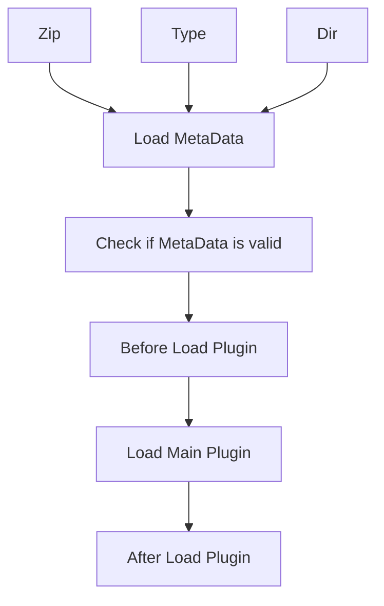

🌍<a href="">English</a> / 中文

# ShadowPluginLoader.WinUI

✨ 在WinUI3中加载插件(拓展) ✨

  
  
  

 

  📖<a href="https://plugin-loader.kituin.fun/zh/">文档</a>
  ·
  🐛<a href="https://github.com/kitUIN/ShadowPluginLoader.WinUI/issues/new">提交建议</a>
  

## ✨简介

在`Windows App SDK`上使用插件加载器加载插件

插件内以下内容可以被加载:
- [x] `C#代码`
- [x] 自定义`WinUI控件`(`Page`/`UserControl`)
- [x] 自定义`资源字典`(`ResourceDictionary`)
- [x] `图片资源`(`Assets`)
- [x] `i18n`(`Resw`)
## 🚀快速开始

仅需几个步骤即可构建属于你的插件加载器
- [快速开始](https://plugin-loader.kituin.fun/zh/init/)

## 🧐必要规范

由于特殊的加载模式,我们需要遵循一些代码准则
- [关于准则](https://plugin-loader.kituin.fun/zh/plugin/)

## 加载流程

## 🥰特别鸣谢

- 📦[kitUIN.CustomExtensions.WinUI](https://github.com/kitUIN/CustomExtensions.WinUI) 提供插件加载支持
- 🛠️[ShadowPluginLoader.Tool](https://github.com/kitUIN/ShadowPluginLoader.Tool) 提供插件构建工具
- 🛠️[ShadowPluginLoader.SourceGenerator](https://github.com/kitUIN/ShadowPluginLoader.WinUI/tree/master/ShadowPluginLoader.SourceGenerator) 自动生成帮助类
- 🎉[winui-extensions](https://github.com/dnchattan/winui-extensions) 开创了WinUI3中加载插件的先河
- 📦[DryIoc](https://github.com/dadhi/DryIoc) 提供灵活的依赖注入
- 🛠️[SharpCompress](https://github.com/adamhathcock/sharpcompress) - 提供压缩解压支持  
- 📃[Serilog](https://serilog.net/) 提供开箱即用的日志
- 💡[WindowsAppSDK](https://github.com/microsoft/WindowsAppSDK) 提供框架支持
