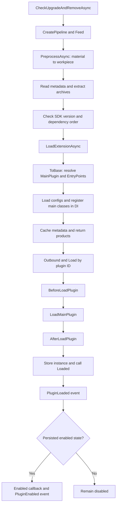

# Plugin Loading Flow

What happens after you call `ProcessAsync()`? This diagram follows a plugin from its input file to a ready instance.

First, the loader reads the package or downloads the file, then checks its metadata and dependencies. Next, it loads the DLL, prepares configuration, creates the plugin instance, and tells the app that the plugin is ready.

Dependencies load first. Otherwise, smaller `Priority` values load earlier. If a batch includes several versions with the same ID, the higher version is selected.

Already loaded plugins are skipped. To update one, use the update method and restart the app.

See [Install, Update, and Remove](/plugin/install) to use the loader, or [Custom Loading Logic](/advance/customloadplugin) to add your own steps.
