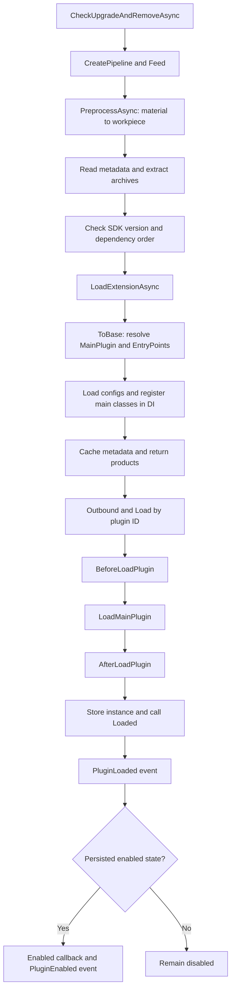

# Plugin Loading Flow

What happens from startup checks through `ProcessAsync()`? Choose a scenario, then use Next or Play to follow calls and events. Select a phase or step to jump directly to it.

## Interactive loading flow

<PluginLoadingFlow locale="en" />

The simulation follows the default loader, assuming callbacks do not change `IsEnabled` themselves and event subscribers return normally. Choose “Loaded() throws” for a failure path, or “Disable after loading” to see when `PluginDisabled` fires.

### Three different notification channels

- **Progress**: the `IProgress<PipelineProgress>` passed to `ProcessAsync(progress)` reports `Preprocessing`, `MainProcessing`, `Outbounding`, and `Success`. These are not plugin events; asynchronous progress handlers may run later than the report call.
- **Callbacks and hooks**: override `BeforeLoadPlugin`, `AfterLoadPlugin`, `Loaded()`, `Enabled()`, and other lifecycle methods in the loader or plugin.
- **Public events**: subscribe to `IPluginEventService`. Normal loading emits `PluginLoaded`, then `PluginEnabled`. Remaining disabled only emits `PluginLoaded`; an initially disabled state does not emit `PluginDisabled`.

Events invoke subscribers synchronously, so a throwing subscriber can interrupt loading. There is no public `PluginLoadFailed` event; handle exceptions at the call site. The simulated failure does not automatically roll back an already stored instance.

## Flow overview



First, the loader reads the package or downloads the file, then checks its metadata and dependencies. Next, it loads the DLL, prepares configuration, creates the plugin instance, and tells the app that the plugin is ready.

Dependencies load first. Otherwise, smaller `Priority` values load earlier. If a batch includes several versions with the same ID, the higher version is selected.

Already loaded plugins are skipped. To update one, use the update method and restart the app.

See [Install, Update, and Remove](/plugin/install) to use the loader, or [Custom Loading Logic](/advance/customloadplugin) to add your own steps.

## Embed in another tutorial

The documentation theme registers this component globally. Add this line to any Markdown tutorial in this site; no import is required:

```md
<PluginLoadingFlow locale="en" />
```

Use `<PluginLoadingFlow />` for Chinese. Multiple instances play independently, and playback stops when leaving the page.
