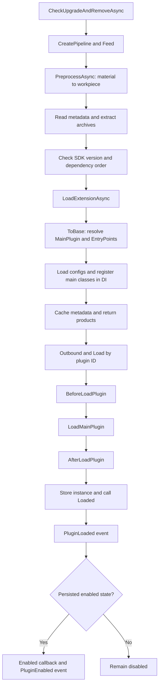

# Plugin Loading Flow

This describes the current default `InstallPipeline`, `MainProcessor`, and `AbstractPluginLoader` workflow.

Preprocessors convert local JSON, archives, and HTTP downloads into workpieces. The main processor extracts archives, parses metadata, checks SDK versions and dependencies, loads assemblies, registers configurations/main classes, and returns plugin IDs. The loader resolves instances in that order and invokes their lifecycle.

Within a batch, duplicate IDs prefer a higher version, then a lower `Priority`. Already loaded assemblies are filtered out. Dependencies load before their dependents; otherwise lower `Priority` values go first. This does not support unloading or replacing assemblies at runtime.

See [Installation and Management](/plugin/install) and [Custom Loading Logic](/advance/customloadplugin).
