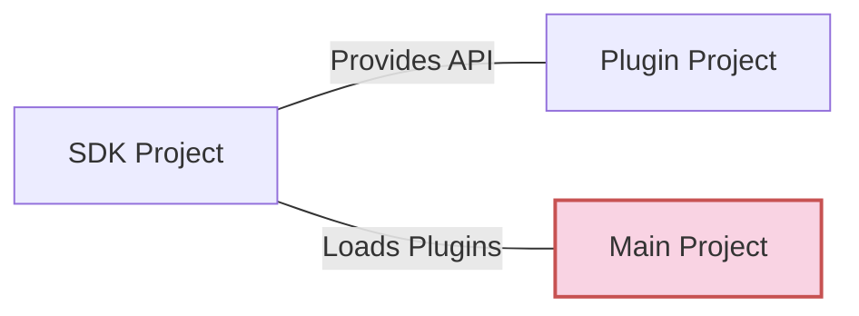

# Create SDK Project

We first need an SDK library for loading plugins and providing APIs for plugins.



## Create SDK Project

Create a new `WinUI` class library in `VS`.

This article uses a project named `ShadowExample.Core` as an example.


After creation, open the `.csproj` file and add the following code:

```xml [ShadowExample.Core.csproj]
<Project Sdk="Microsoft.NET.Sdk">
  <PropertyGroup>
    <TargetFramework>net6.0-windows10.0.19041.0</TargetFramework>
    <TargetPlatformMinVersion>10.0.17763.0</TargetPlatformMinVersion>
    <RootNamespace>ShadowExample.Core</RootNamespace>
    <RuntimeIdentifiers>win10-x86;win10-x64;win10-arm64</RuntimeIdentifiers>
    <UseWinUI>true</UseWinUI>
	  <NoWarn>MSB3277</NoWarn>
    <LangVersion>12</LangVersion>
    <CopyLocalLockFileAssemblies>true</CopyLocalLockFileAssemblies> <!-- [!code highlight] -->

    <!-- Regular Nuget properties -->  <!-- [!code highlight] -->
    <Version>1.0.0.34</Version>  <!-- [!code highlight] -->
    <PackageId>ShadowExample.Core</PackageId>  <!-- [!code highlight] -->
    <Authors>kitUIN</Authors>  <!-- [!code highlight] -->
    <GeneratePackageOnBuild>true</GeneratePackageOnBuild>  <!-- [!code highlight] -->
    <PackageLicenseExpression>MIT</PackageLicenseExpression>  <!-- [!code highlight] -->
    <PackageProjectUrl>https://github.com/kitUIN/ShadowPluginLoader.WinUI</PackageProjectUrl>  <!-- [!code highlight] -->
    <RepositoryUrl>https://github.com/kitUIN/ShadowPluginLoader.WinUI</RepositoryUrl>  <!-- [!code highlight] -->
    <Description>✨ ShadowExample.Core ✨</Description>  <!-- [!code highlight] -->
    <Copyright>Copyright 2024</Copyright>  <!-- [!code highlight] -->
    <PackageTags>kitUIN;wasdk;plugin-loader;plugin;extension;winui</PackageTags>  <!-- [!code highlight] -->
    <PackageOutputPath>..\NugetPackages</PackageOutputPath>  <!-- [!code highlight] -->
    <!-- <PackageReadmeFile>README.md</PackageReadmeFile> -->  <!-- [!code highlight] -->
  </PropertyGroup>
 

  <ItemGroup>
      <PackageReference Include="Microsoft.WindowsAppSDK" Version="1.4.230913002" />
      <PackageReference Include="Microsoft.Windows.SDK.BuildTools" Version="10.0.22621.755" />
      <PackageReference Include="ShadowPluginLoader.WinUI" Version="<Fill in latest version>" />  <!-- [!code highlight] -->
  </ItemGroup>
	
</Project>
```

Where:
- `CopyLocalLockFileAssemblies` exports files from dependency libraries to prevent missing libraries during metadata pre-generation
- `ShadowPluginLoader.WinUI` is our required dependency library
  - Latest version: [](https://www.nuget.org/packages/ShadowPluginLoader.WinUI/)
- `GeneratePackageOnBuild` set to `true` will automatically package as `nuget` package during build
- `LangVersion` is the C# version number, requires `12` or higher
- `Version` is the program/nuget version number
- `PackageId` is the nuget package name
- `Authors` is the nuget package author
- `PackageLicenseExpression` is the nuget package license
- `PackageProjectUrl` is the nuget package project URL
- `RepositoryUrl` is the nuget package repository URL
- `Description` is the nuget package description
- `Copyright` is the nuget package copyright
- `PackageTags` is the nuget package tags
- `PackageOutputPath` is the nuget package output path

::: tip Note
- The content below `<!-- Nuget -->` are settings for generating `nuget` packages
- For MSBuild nuget generation, see: [Creating NuGet packages using MSBuild](https://learn.microsoft.com/en-us/nuget/create-packages/creating-a-package-msbuild)
- For available MSBuild properties, see: [Package targets](https://learn.microsoft.com/en-us/nuget/reference/msbuild-targets#pack-target)
:::

After creating the project, we can directly `build` it, and a `Tools.Config.props` file will appear in this directory.

::: tip Note

For the `Tools.Config.props` file, see: [Tools.Config.props](/advance/toolconfig)

:::

Set `<IsPluginLoader>` to `true` to indicate this project is a plugin loader project:
```xml [Tools.Config.props]
<?xml version="1.0" encoding="utf-8" ?>
<Project xmlns="http://schemas.microsoft.com/developer/msbuild/2003">
    <PropertyGroup>
        <!-- Whether the current project is a PluginLoader -->
        <IsPluginLoader>true</IsPluginLoader>  <!-- [!code focus] -->
        <!-- Whether the current project is a Plugin -->
        <IsPlugin>false</IsPlugin>
        <!-- Auto Pack Plugin -->
        <AutoPluginPackage>true</AutoPluginPackage>
        <!-- Auto Generate I18N -->
        <AutoGenerateI18N>true</AutoGenerateI18N>
    </PropertyGroup>
</Project>
```

## Content

Your `PluginLoader` library (can be called `SDK`) needs to provide plugin information for the main application and all plugins, and should include:

- [Plugin Metadata Class](/init/metaplugin)
- [Plugin Base Class](/init/iplugin)
- [Plugin Loader Class](/init/customloaderclass)
- [Custom Plugin Loading Logic](/advance/customloadplugin)
- [Use I18N (Internationalization)](/advance/i18n)
