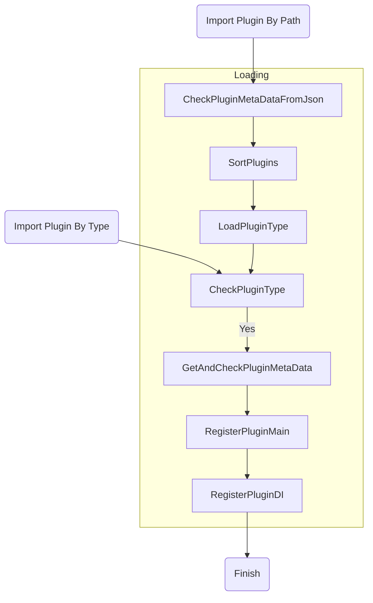

```mermaid
graph TB
  p0(Import Plugin By Path)-->p1[CheckPluginMetaDataFromJson]
  t0(Import Plugin By Type)-->t1[CheckPluginType]
  t4-->t00(Finish)
  subgraph Loading
    p1-->p2[SortPlugins]
    p2-->p3[LoadPluginType]
    p3-->t1
    t1--Yes-->t2[GetAndCheckPluginMetaData]
    t2-->t3[RegisterPluginMain]
    t3-->t4[RegisterPluginDI]
end
```