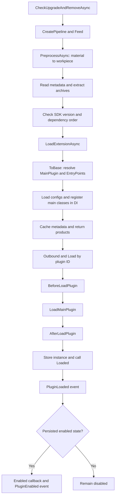

# 插件加载流程

从启动检查到 `ProcessAsync()` 完成，加载器会怎样一步步把插件准备好？先选择一个场景，再用「下一步」或「自动播放」观察调用顺序和事件轨迹。也可以点击阶段与步骤直接跳转。

## 交互式加载演示

<PluginLoadingFlow />

演示基于默认加载器，假设生命周期回调不主动修改 `IsEnabled`，事件订阅者正常返回。选择「Loaded() 抛出异常」可查看异常分支；选择「加载后手动禁用」可查看 `PluginDisabled` 的触发时机。

### 三种通知各有什么用

- **进度通知**：通过传给 `ProcessAsync(progress)` 的 `IProgress<PipelineProgress>` 报告，包括 `Preprocessing`、`MainProcessing`、`Outbounding` 和 `Success`。它们不是插件事件，异步进度处理器的实际执行时机可能晚于报告时机。
- **回调与钩子**：`BeforeLoadPlugin`、`AfterLoadPlugin`、`Loaded()`、`Enabled()` 等供加载器或插件重写。
- **公共事件**：订阅 `IPluginEventService`，正常加载依次得到 `PluginLoaded`、`PluginEnabled`。保持禁用只得到 `PluginLoaded`，不会因初始禁用状态触发 `PluginDisabled`。

事件是同步调用的；如果订阅者抛出异常，也可能中断后续加载。SDK 没有公共的 `PluginLoadFailed` 事件，应在调用处处理异常。演示中的异常场景不会自动回滚已保存的实例。

## 流程总览



先读取插件包或下载文件，再检查插件信息和依赖。检查完成后，加载器会加载 DLL、准备配置，最后创建插件实例，并通知主程序“插件加载好了”。

如果插件依赖其他插件，会先加载它们。没有依赖关系时，`Priority` 越小越早加载。同一次处理里出现相同 ID 的多个版本，会优先选择高版本。

已经加载的插件会跳过。要更新它，请使用更新方法，并在重启后生效。

想直接使用，可以看[安装、更新和删除](/zh/plugin/install)；想在某个步骤加入自己的处理，可以看[自定义加载逻辑](/zh/advance/customloadplugin)。

## 嵌入其他教程

该组件已在文档主题中全局注册。在本站任意 Markdown 教程中插入下面一行即可直接交互，无需额外导入：

```md
<PluginLoadingFlow />
```

英文教程使用 `<PluginLoadingFlow locale="en" />`。同一页面可放置多个演示，每个演示独立播放；页面切换时会停止播放。
