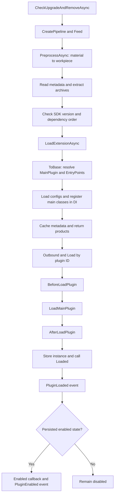

# 插件加载流程

以下描述当前默认 `InstallPipeline`、`MainProcessor` 和 `AbstractPluginLoader` 的协作顺序。

预处理器将本地 JSON、压缩包和 HTTP 下载转换为工作件。主处理器解压、解析元数据、检查 SDK 版本与依赖，加载程序集并注册配置与主类，最后输出插件 ID。加载器按该顺序解析实例并触发生命周期。

同一批次的相同 ID 会优先选择更高版本，再比较 `Priority`；已经加载的程序集会被过滤。依赖优先加载，然后才考虑数值较小的 `Priority`。这不提供运行时程序集卸载或替换。

使用方法见[安装与管理](/zh/plugin/install)，扩展方式见[自定义加载逻辑](/zh/advance/customloadplugin)。
