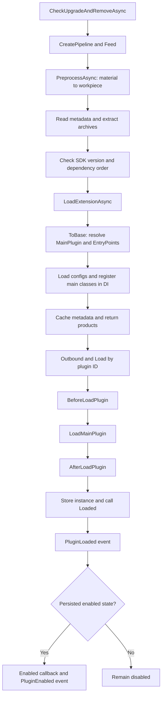

# 插件加载流程

调用 `ProcessAsync()` 之后，加载器会怎样一步步把插件准备好？可以结合下面的流程图来看。

先读取插件包或下载文件，再检查插件信息和依赖。检查完成后，加载器会加载 DLL、准备配置，最后创建插件实例，并通知主程序“插件加载好了”。

如果插件依赖其他插件，会先加载它们。没有依赖关系时，`Priority` 越小越早加载。同一次处理里出现相同 ID 的多个版本，会优先选择高版本。

已经加载的插件会跳过。要更新它，请使用更新方法，并在重启后生效。

想直接使用，可以看[安装、更新和删除](/zh/plugin/install)；想在某个步骤加入自己的处理，可以看[自定义加载逻辑](/zh/advance/customloadplugin)。
