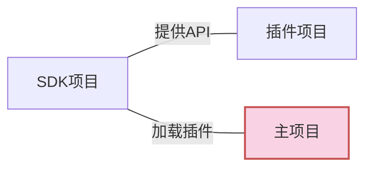

# 创建SDK项目

我们首先需要一个SDK库,用于加载插件,并且为插件提供API



## 创建SDK项目

在`VS`中新建一个`WinUI`类库

本文以名为`ShadowExample.Core`的项目为例


创建完成后,打开`.csproj`文件,添加以下代码

```xml [ShadowExample.Core.csproj]
<Project Sdk="Microsoft.NET.Sdk">
  <PropertyGroup>
    <TargetFramework>net6.0-windows10.0.19041.0</TargetFramework>
    <TargetPlatformMinVersion>10.0.17763.0</TargetPlatformMinVersion>
    <RootNamespace>ShadowExample.Core</RootNamespace>
    <RuntimeIdentifiers>win10-x86;win10-x64;win10-arm64</RuntimeIdentifiers>
    <UseWinUI>true</UseWinUI>
	  <NoWarn>MSB3277</NoWarn>
    <LangVersion>12</LangVersion>
    <CopyLocalLockFileAssemblies>true</CopyLocalLockFileAssemblies> <!-- [!code highlight] -->

    <!-- 常规的Nuget属性 -->  <!-- [!code highlight] -->
    <Version>1.0.0.34</Version>  <!-- [!code highlight] -->
    <PackageId>ShadowExample.Core</PackageId>  <!-- [!code highlight] -->
    <Authors>kitUIN</Authors>  <!-- [!code highlight] -->
    <GeneratePackageOnBuild>true</GeneratePackageOnBuild>  <!-- [!code highlight] -->
    <PackageLicenseExpression>MIT</PackageLicenseExpression>  <!-- [!code highlight] -->
    <PackageProjectUrl>https://github.com/kitUIN/ShadowPluginLoader.WinUI</PackageProjectUrl>  <!-- [!code highlight] -->
    <RepositoryUrl>https://github.com/kitUIN/ShadowPluginLoader.WinUI</RepositoryUrl>  <!-- [!code highlight] -->
    <Description>✨ ShadowExample.Core ✨</Description>  <!-- [!code highlight] -->
    <Copyright>Copyright 2024</Copyright>  <!-- [!code highlight] -->
    <PackageTags>kitUIN;wasdk;plugin-loader;plugin;extension;winui</PackageTags>  <!-- [!code highlight] -->
    <PackageOutputPath>..\NugetPackages</PackageOutputPath>  <!-- [!code highlight] -->
    <!-- <PackageReadmeFile>README.md</PackageReadmeFile> -->  <!-- [!code highlight] -->
  </PropertyGroup>
 

  <ItemGroup>
      <PackageReference Include="Microsoft.WindowsAppSDK" Version="1.4.230913002" />
      <PackageReference Include="Microsoft.Windows.SDK.BuildTools" Version="10.0.22621.755" />
      <PackageReference Include="ShadowPluginLoader.WinUI" Version="<填写最新版本>" />  <!-- [!code highlight] -->
  </ItemGroup>
	
</Project>
```

其中: 
- `CopyLocalLockFileAssemblies`是导出依赖库中的文件,这是为了防止预生成元数据时找不到对应的库
- `ShadowPluginLoader.WinUI` 是我们必须的依赖库
  - 最新版本为: [](https://www.nuget.org/packages/ShadowPluginLoader.WinUI/)
- `GeneratePackageOnBuild`设置为`true`将会自动在构建时打包为`nuget`包
- `LangVersion`即为C#版本号,需要`12`以上
- `Version`即为程序/nuget的版本号
- `PackageId`即为nuget包的包名
- `Authors`即为nuget包的作者
- `PackageLicenseExpression`即为nuget包的许可证
- `PackageProjectUrl`即为nuget包的项目地址
- `RepositoryUrl`即为nuget包的仓库地址
- `Description`即为nuget包的描述
- `Copyright`即为nuget包的版权
- `PackageTags`即为nuget包的标签
- `PackageOutputPath`即为nuget包的输出路径

::: tip 说明
- `<!-- Nuget -->` 下方的是生成`nuget`包的一些设置
- 关于`MSBuild`中`nuget`的生成可以查看该文章:[使用 MSBuild 创建 NuGet 包](https://learn.microsoft.com/zh-cn/nuget/create-packages/creating-a-package-msbuild)
- 一些可以使用的MSBuild属性可以查看该文章:[包目标](https://learn.microsoft.com/zh-cn/nuget/reference/msbuild-targets#pack-target)
:::

创建完项目之后,我们可以直接`构建`一下,在本目录会出现一个`Tools.Config.props`文件

::: tip 说明

关于`Tools.Config.props`文件,可查阅: [Tools.Config.props](/zh/advance/toolconfig)

:::


将其中的`<IsPluginLoader>`设置为`true`,标明本项目是一个插件加载器项目
```xml [Tools.Config.props]
<?xml version="1.0" encoding="utf-8" ?>
<Project xmlns="http://schemas.microsoft.com/developer/msbuild/2003">
    <PropertyGroup>
        <!-- Whether the current project is a PluginLoader -->
        <IsPluginLoader>true</IsPluginLoader>  <!-- [!code focus] -->
        <!-- Whether the current project is a Plugin -->
        <IsPlugin>false</IsPlugin>
        <!-- Auto Pack Plugin -->
        <AutoPluginPackage>true</AutoPluginPackage>
        <!-- Auto Generate I18N -->
        <AutoGenerateI18N>true</AutoGenerateI18N>
    </PropertyGroup>
</Project>
```
## 内容

你的`PluginLoader`库(可以称为`SDK`)需要给给本体和所有插件提供插件信息,应当包含以下内容:

- [插件元数据类](/zh/init/metaplugin)
- [插件基类](/zh/init/iplugin)
- [插件加载器类](/zh/init/customloaderclass)
- [自定义插件加载逻辑](/zh/advance/customloadplugin)
- [使用I18N(国际化)](/zh/advance/i18n)
